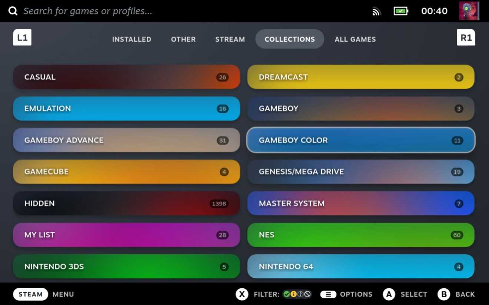
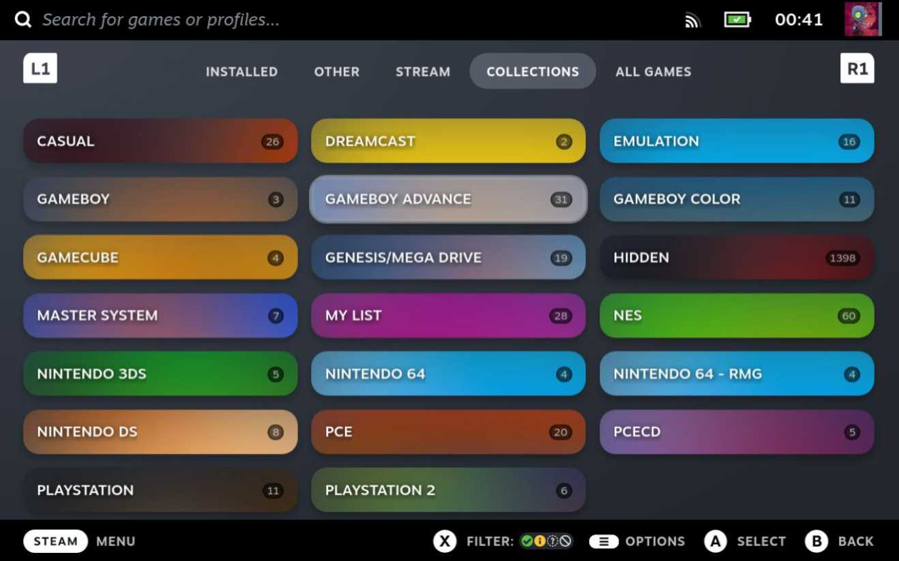
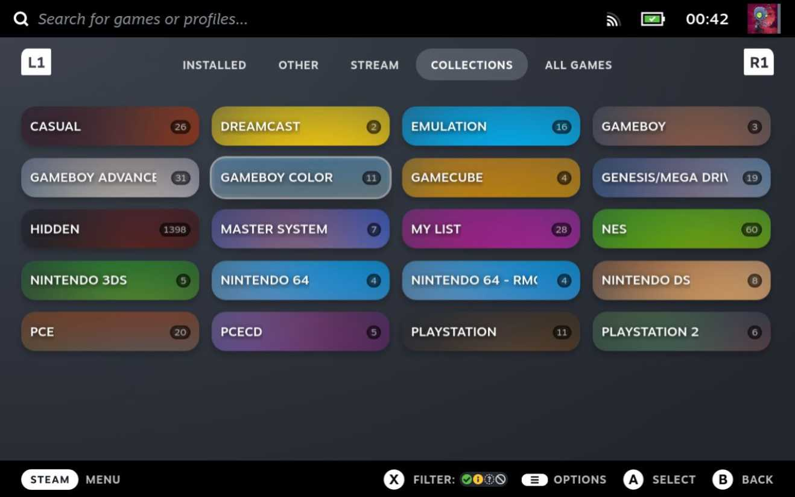
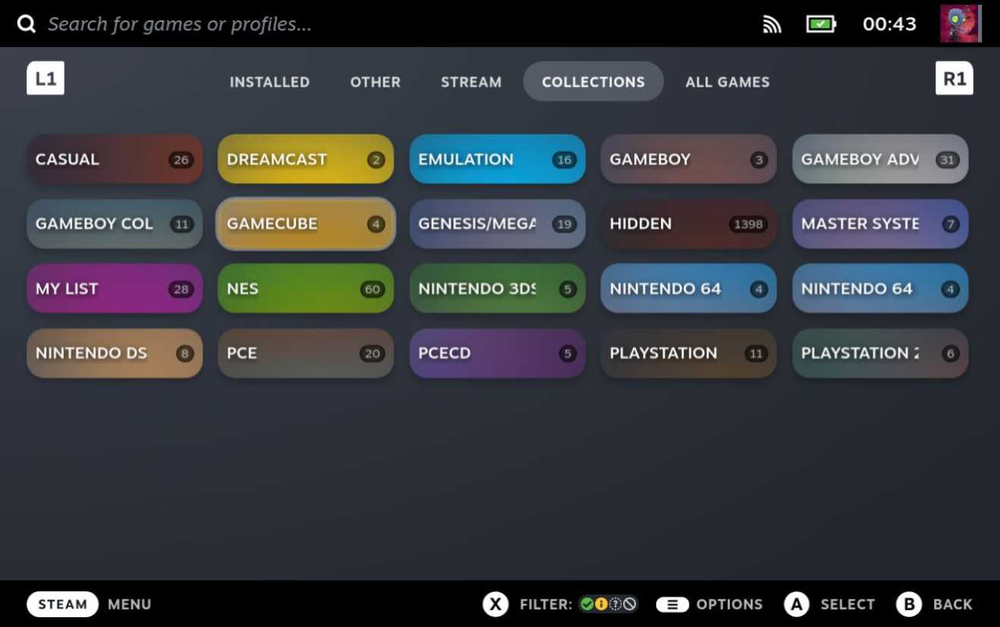

# Compact Collection (Steam Deck Theme)

This theme make your collection page more compact.

## Installation

1. Install decky-loader.
1. Install the CSS Loader by using Plugin Store in decky-loader.
1. Switch to desktop mode and open `/home/deck/homebrew/themes` in the file browser.
1. Copy the theme files into this folder.
1. Go back to game mod and enable your theme in CSS Loader.
